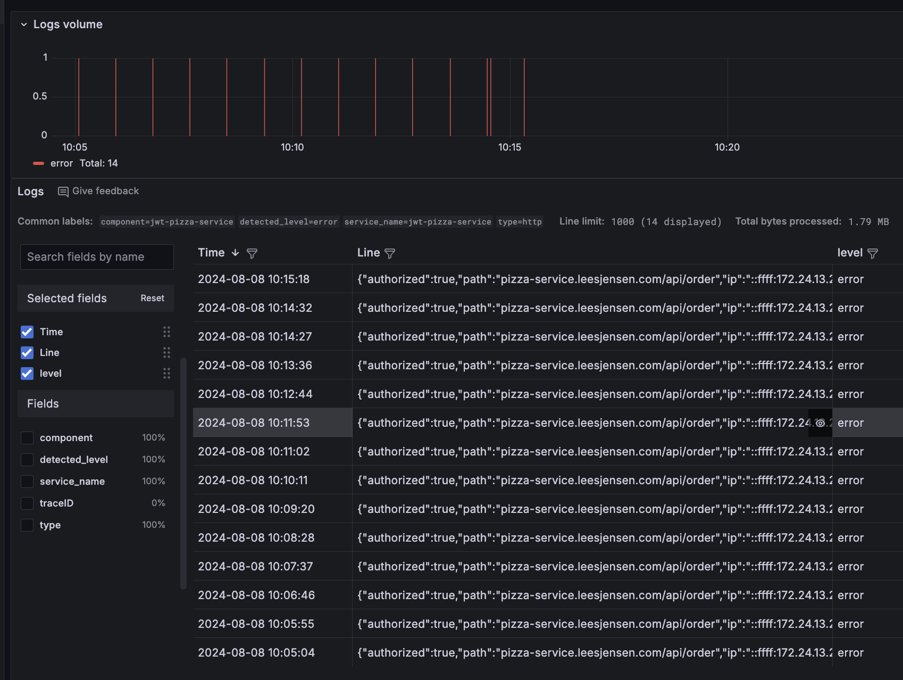
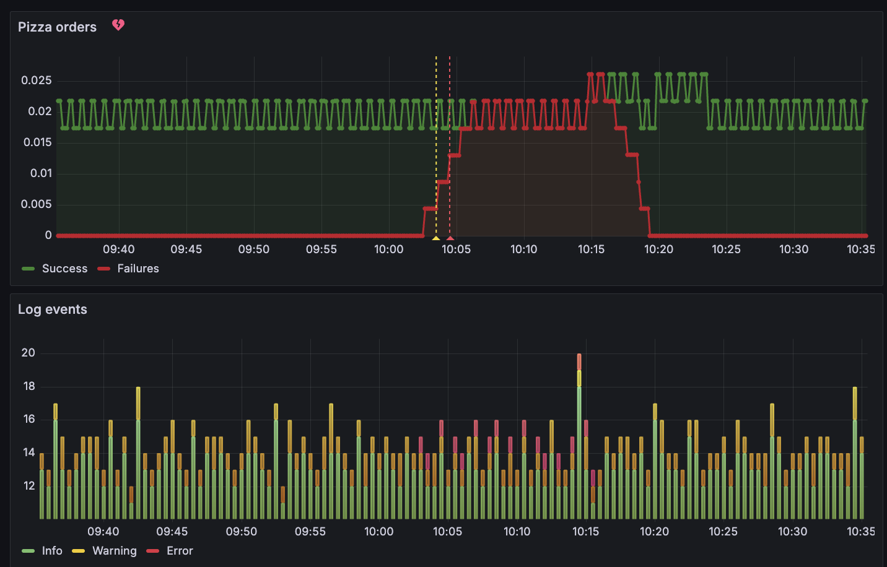
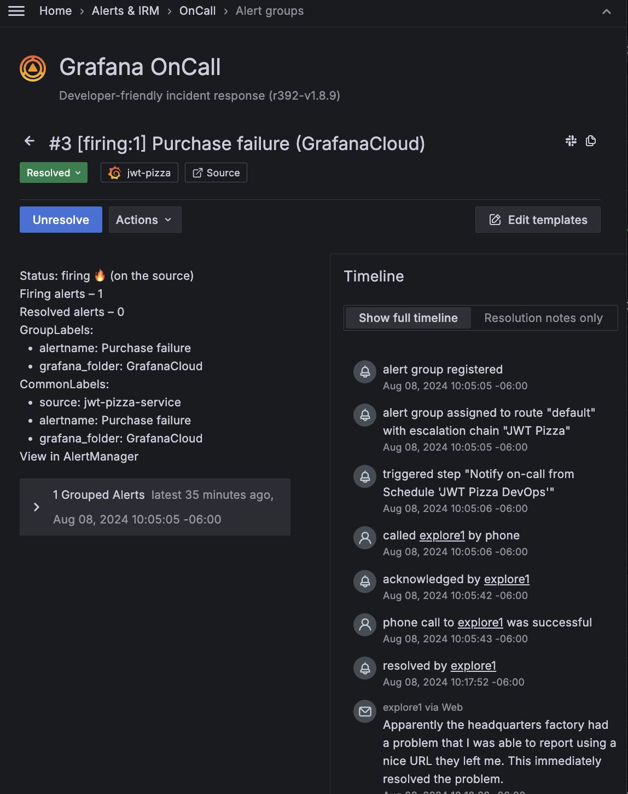

# Incident: 2024-08-08 10:05-00 MT

## Summary

The JWT Headquarters Pizza Factory failed to create pizzas for a period of 10 minutes. This impacted diners ability to order pizzas and resulting in a partial loss of revenue. The error was caused by a failure in the factory service. The on call team was activated within 1 minute of the failure and notified JWT Headquarters within 9 minutes after diagnosing the source of the failure. JWT Headquarters immediately resolved the issue and functionality returned to a nominal state.

## Detection

This incident was detected when a Grafana metrics critical alert was triggered and JWT Pizza DevOps on call team member was paged.

**Issue ID**: #3 [Alert detail](https://explore1.grafana.net/a/grafana-oncall-app/alert-groups/I8AM9U35LUPZB)

Lee Jensen responded immediately to the alert and acknowledged that he was investigating the issue.

## Impact

For 10 minutes between 10:05 and 10:15 MT no pizzas could be purchased by our diners.

This incident affected 14 pizza purchase.

No support tickets or negative social media posts were issues. This was probably due to the short period and low impact of the issue.

## Timeline

All times are MT.

- _10:00_ - JWT Pizza Headquarters enters a failure state
- _10:02_ - First pizza failure occurs
- _10:03_ - Alerting system enters the pending state
- _10:04_ - Alerting system enters the failure state after 3 order failures
- _10:05:06_ - Lee Jensen notified by phone
- _10:05:24_ - Lee Jensen acknowledges incident
- _10:07:00_ - Failure reproduced in application
- _10:14:00_ - Root cause determined
- _10:15:00_ - JWT Headquarters notified of error
- _10:15:00_ - Resolution verified in application
- _10:17:52_ - Incident marked as resolved

## Response

After receiving a page at 10:05:06, Lee Jensen came online at 10:05:24 and began researching the issue.

# Root cause

A bug in JWT Headquarters pizza ordering system was determined to be the cause of the failure. They have not yet explained the root of the problem in their system.

## Resolution

The alerting system efficiently notified us of the issue and the on call team immediately resolved the problem within a reasonable period of time. Using the issue reporting URL provided by JWT Headquarters the failure immediately resolved.

# Prevention

We need to schedule a meeting with JWT Headquarters to better understand what the failure was and what they are going to do in order to mitigate this from happening in the future.

# Action items

1. Meet with JWT Headquarters to do a post mortem.
1. Explore a way to automate the execution of the URL for reporting the issue to JWT Headquarters. This would have dropped the incident time to seconds.
